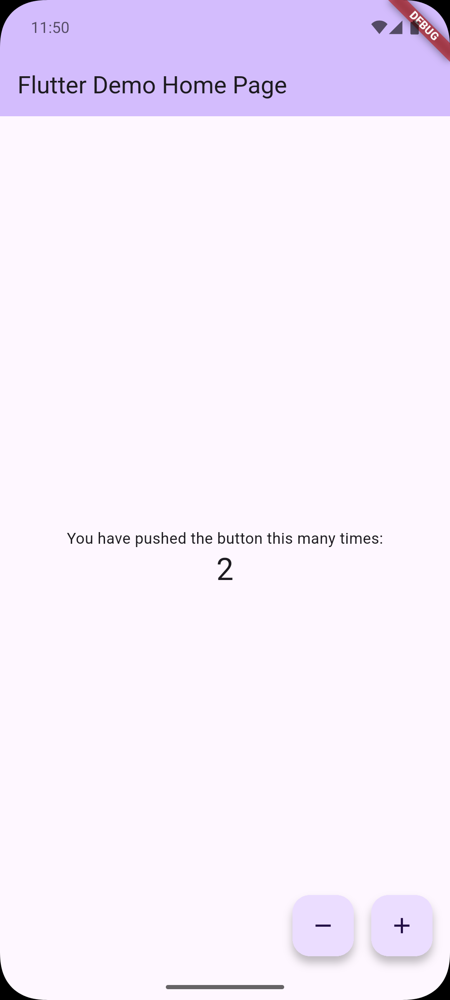
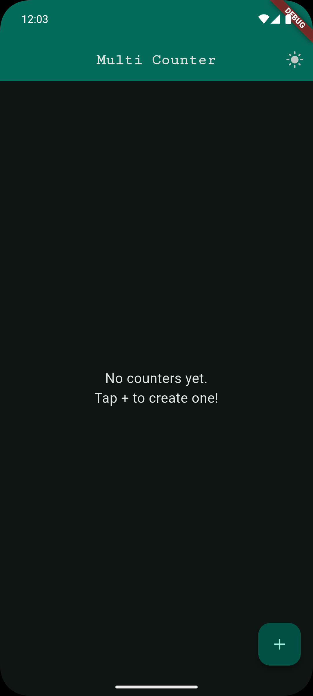
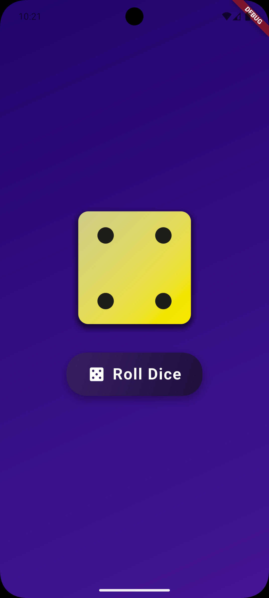

# Projects Index

1. **first_app**

   

   To see more details: [Click](first_app/README.md)

   - Built a counter application with increment/decrement functionality
   - Implemented state management using StatefulWidget and setState()
   - Added boundary validation with auto-reset at ±10 limits
   - Integrated SnackBar for user feedback notifications

2. **counter_app**

   
   To see more details: [Click](counter_app/README.md)
   - Developed a multi-counter app with CRUD operations (Create, Read, Update, Delete)
   - Implemented dynamic theming with dark/light mode toggle
   - Used ListView.builder for efficient rendering of multiple counters
   - Created reusable Card widgets with custom styling
   - Applied AlertDialog for user input handling

3. **roll_dice_app**

   

   To see more details: [Click](roll_dice_app/README.md)

   - Created an interactive dice rolling application
   - Implemented custom gradient backgrounds using LinearGradient
   - Used random number generation for dice outcomes
   - Organized code with screens and widgets folders (modular architecture)

4. **quiz_app**
   
   To see more details: [Click](quiz_app/README.md)
   - Built a complete quiz application with multiple-choice questions
   - Implemented multi-screen navigation (start screen, questions screen, results screen)
   - Used StatefulWidget for state management across screens
   - Created custom data models (QuizQuestion) with answer shuffling
   - Implemented answer tracking and score calculation
   - Built a scrollable results summary with question-by-question breakdown
   - Added restart functionality to reset quiz state
   - Applied Google Fonts for enhanced typography
   - Used gradient backgrounds and custom styling for UI polish

5. **expense_tracker**
   
   To see more details: [Click](expense_tracker/README.md)
   - Built a personal expense tracking app with visual analytics
   - Implemented expense categories (Food, Travel, Leisure, Work) with icons
   - Created bar chart visualization showing expense distribution by category
   - Used modal bottom sheet for adding new expenses with form validation
   - Implemented swipe-to-delete with undo functionality via SnackBar
   - Applied custom theming with light/dark mode support
   - Used responsive layout adapting to portrait/landscape orientations
   - Organized code with models, widgets, and chart components

6. **todo_app**
   
   To see more details: [Click](todo_app/README.md)
   - Built a Flutter internals demo focusing on Keys and UI updates
   - Implemented checkable todo items with priority levels (Urgent, Normal, Low)
   - Created sortable list with ascending/descending toggle
   - Demonstrated ObjectKey usage for preserving widget state during reordering
   - Explored widget lifecycle and Element tree concepts
   - Used StatefulWidget for local checkbox state management

7. **meals_app**
   
   To see more details: [Click](meals_app/README.md)
   - Built a recipe browsing app with category-based meal organization
   - Implemented bottom tab navigation (Categories, Favorites)
   - Created dietary filters (gluten-free, lactose-free, vegetarian, vegan)
   - Added favorites functionality with state lifting pattern
   - Used drawer navigation for accessing filters screen
   - Implemented multi-screen navigation with data passing
   - Displayed meal details with ingredients and cooking steps
   - Applied custom dark theme with Google Fonts

8. **shopping_list_app**
   
   To see more details: [Click](shopping_list_app/README.md)
   - Built a grocery list app with Firebase Realtime Database backend
   - Implemented HTTP networking (GET, POST, DELETE) using http package
   - Created RESTful API communication with Firebase REST endpoints
   - Used async/await patterns for network requests
   - Implemented loading states and error handling for async operations
   - Added form validation with DropdownButtonFormField and TextFormField
   - Applied swipe-to-delete with Dismissible widget and server sync
   - Demonstrated optimistic updates with rollback on failure

9. **favourite_places**
   
   To see more details: [Click](favourite_places/README.md)
   - Built a favorite places app with image picking and location features
   - Implemented image selection using image_picker package
   - Integrated Google Maps for location selection and display
   - Used SQLite for local data persistence of places
   - Created custom Place model with title, image, and location data
   - Applied state management with Provider package
   - Implemented navigation between screens (places list, add place, place detail)
   - Used FutureBuilder for async data loading from database
   - Applied custom theming and styling for UI consistency

10. **chat_app**

   To see more details: [Click](chat_app/README.md)
   - Built a complete chat app with email/password authentication (sign-up and login)
   - Implemented real-time messaging using Cloud Firestore with StreamBuilder
   - Integrated Firebase Storage for user profile image uploads with optimization
   - Added push notifications via Firebase Cloud Messaging (FCM) with topic subscription
   - Created intelligent message bubbles that group consecutive messages from same user
   - Used image_picker for camera-based profile photo selection
   - Stored user profiles in Firestore (username, email, image URL)
   - Applied Material Design theme with purple color scheme
   - Demonstrated async/await patterns with proper `mounted` checks for context safety
   - Organized code with screens (splash, auth, chat) and reusable widgets