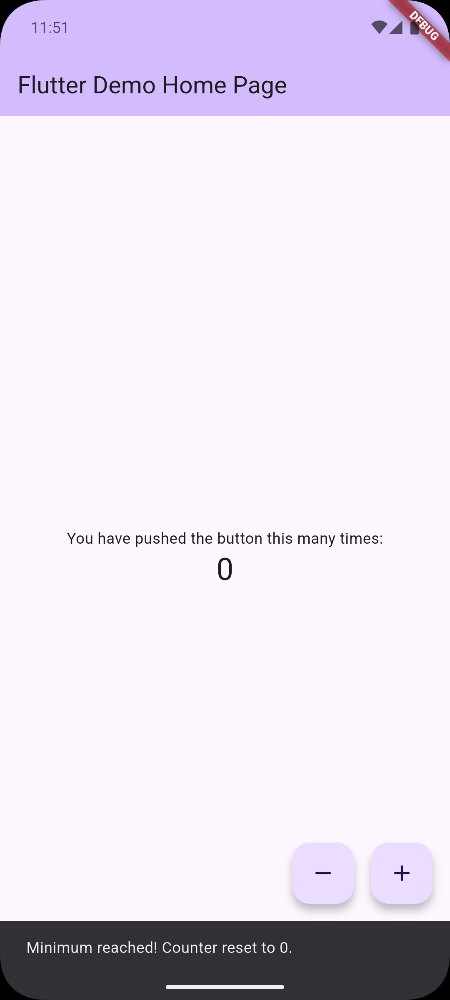

# First App

A simple Flutter counter app with increment and decrement functionality.

  

## Features

- Increment and decrement counter with floating action buttons
- Counter resets to 0 when exceeding +10 or -10
- Shows a popup notification when counter resets

## Prerequisites

- [Flutter SDK](https://docs.flutter.dev/get-started/install) installed
- An editor (VS Code, Android Studio, etc.)
- For mobile: Android emulator or iOS simulator
- For desktop: Windows, macOS, or Linux setup

## How to Run

1. Clone the repository:
   ```bash
   git clone <repository-url>
   cd first_app
   ```

2. Install dependencies:
   ```bash
   flutter pub get
   ```

3. Run the app:
   ```bash
   flutter run
   ```

   Or specify a device:
   ```bash
   flutter run -d windows
   flutter run -d chrome
   flutter run -d <emulator-id>
   ```

## Useful Commands

| Command | Description |
|---------|-------------|
| `flutter devices` | List available devices |
| `flutter run` | Run the app |
| `flutter build apk` | Build Android APK |
| `flutter build windows` | Build Windows executable |
