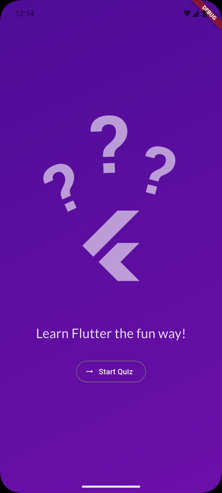
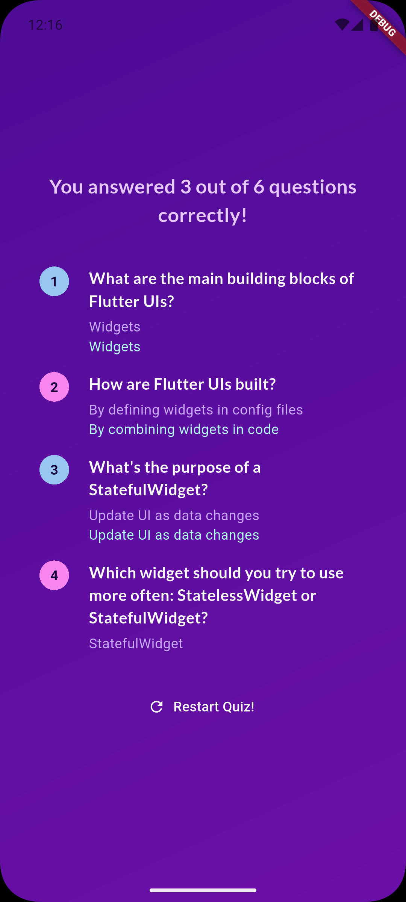
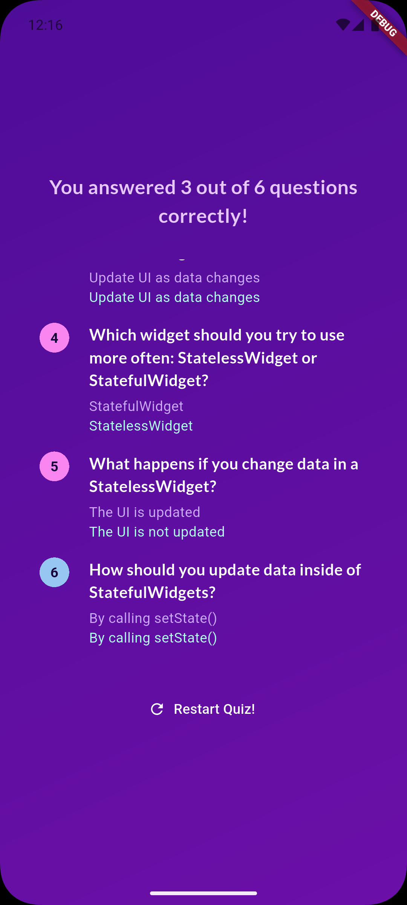

# Quiz App

A Flutter quiz application with multiple-choice questions about Flutter development concepts.

   

## Features

- Start screen with launch button
- Multiple-choice questions with shuffled answers
- Track user answers throughout the quiz
- Results screen with score summary
- Detailed question-by-question breakdown
- Restart quiz functionality
- Beautiful gradient background
- Custom typography using Google Fonts

## Project Structure

```
lib/
├── main.dart                           # App entry point
├── app.dart                            # Main quiz app with state management
├── data/
│   └── questions.dart                  # Quiz questions data
├── models/
│   └── quiz_question.dart              # QuizQuestion data model
├── screens/
│   ├── start_screen.dart               # Welcome screen
│   ├── questions_screen.dart           # Question display and answer selection
│   └── results_screen.dart             # Score and summary display
└── widgets/
    ├── answer_button.dart              # Reusable answer button widget
    └── summary/
        ├── questions_summary.dart      # Summary list widget
        ├── summary_item.dart           # Individual question summary
        └── question_identifier.dart    # Question number indicator
```

## Run the App

```bash
flutter pub get
flutter run
```

## How It Works

1. **Start Screen**: Launch the quiz from the welcome screen
2. **Questions**: Answer 6 multiple-choice questions about Flutter
3. **Results**: View your score and see which questions you got right/wrong
4. **Restart**: Take the quiz again to improve your score