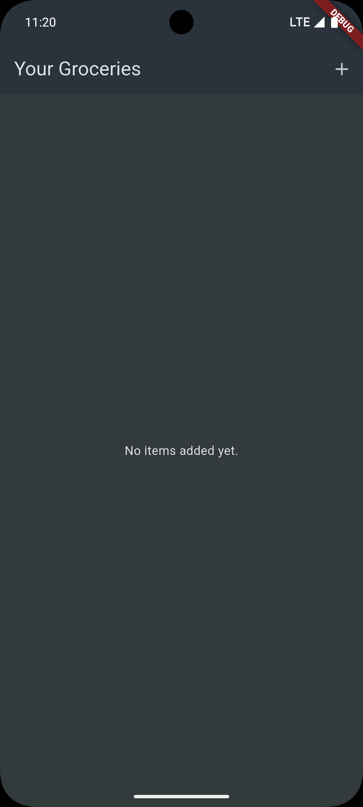
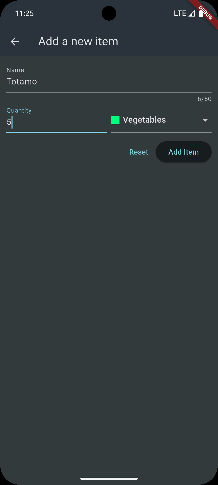
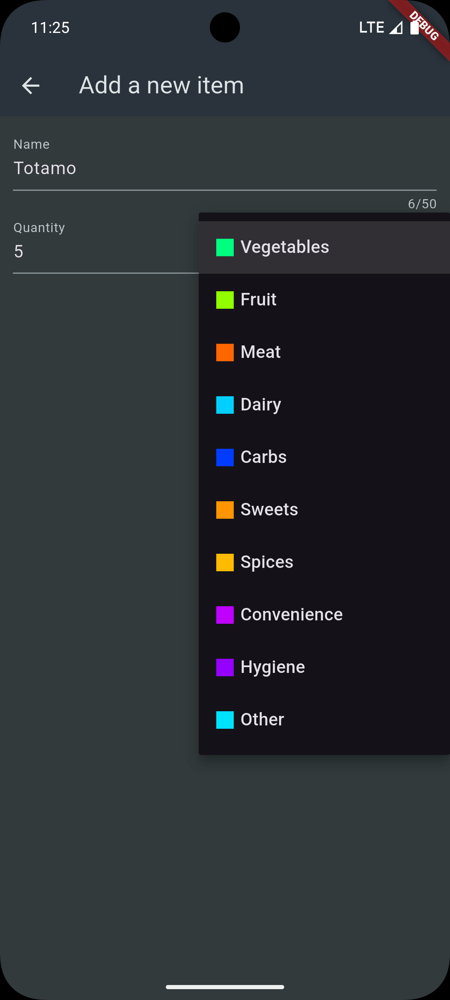
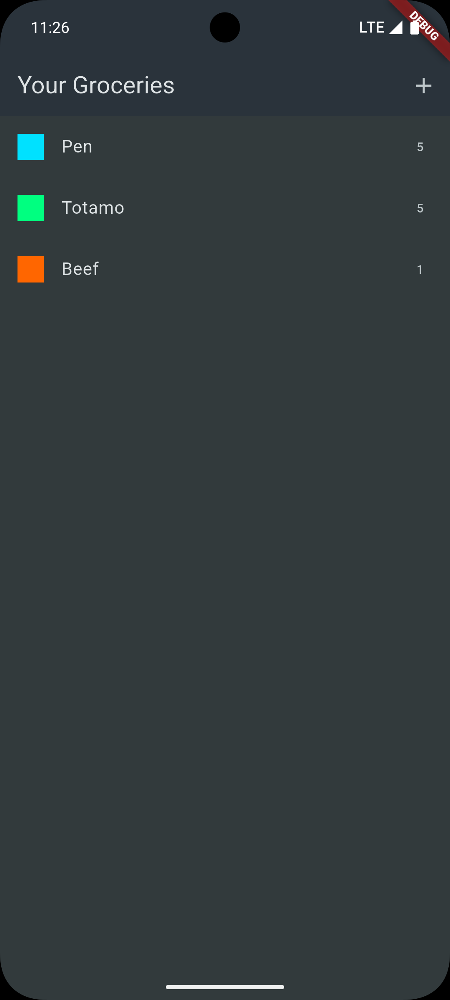

# Shopping List App

A Flutter grocery list application demonstrating HTTP networking with Firebase Realtime Database.

## Learning Focus

This project focuses on **HTTP Networking** and **Backend Integration**:

- RESTful API communication (GET, POST, DELETE)
- Firebase Realtime Database integration
- Async/await patterns for network requests
- Loading states and error handling
- Optimistic updates with rollback on failure

## Features

- Add grocery items with name, quantity, and category
- Category selection with color-coded indicators
- Fetch and display items from Firebase backend
- Swipe-to-delete with server synchronization
- Form validation for user input
- Loading indicators during network operations
- Error handling with user-friendly messages

## Key Concepts Demonstrated

### HTTP Package
```dart
import 'package:http/http.dart' as http;

// GET request
final response = await http.get(url);

// POST request with JSON body
final response = await http.post(
  url,
  headers: {'Content-Type': 'application/json'},
  body: json.encode(data),
);

// DELETE request
await http.delete(url);
```

### Firebase Realtime Database REST API
- URL structure: `https://<project-id>.firebaseio.com/<path>.json`
- POST creates new entries with auto-generated IDs
- GET retrieves data as JSON
- DELETE removes specific entries by ID

### State Management for Async Operations
- `_isLoading` flag for loading indicators
- `_error` state for error messages
- Proper state cleanup on success/failure

## Project Structure

```
lib/
├── main.dart              # App entry point with theme
├── data/
│   └── categories.dart    # Category definitions
├── models/
│   ├── category.dart      # Category model
│   └── grocery_item.dart  # Grocery item model
└── widgets/
    ├── grocery_list.dart  # Main list with CRUD operations
    └── new_item.dart      # Form for adding items
```

## Dependencies

```yaml
dependencies:
  http: ^1.1.0  # HTTP client for API requests
```

## Run the App

```bash
flutter pub get
flutter run
```

## Screenshots

<p float="left">
  
  
  
  
</p>
