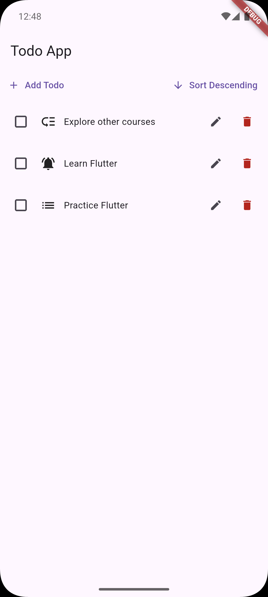
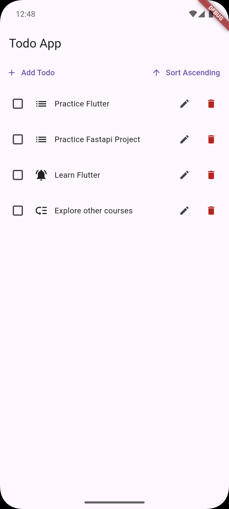
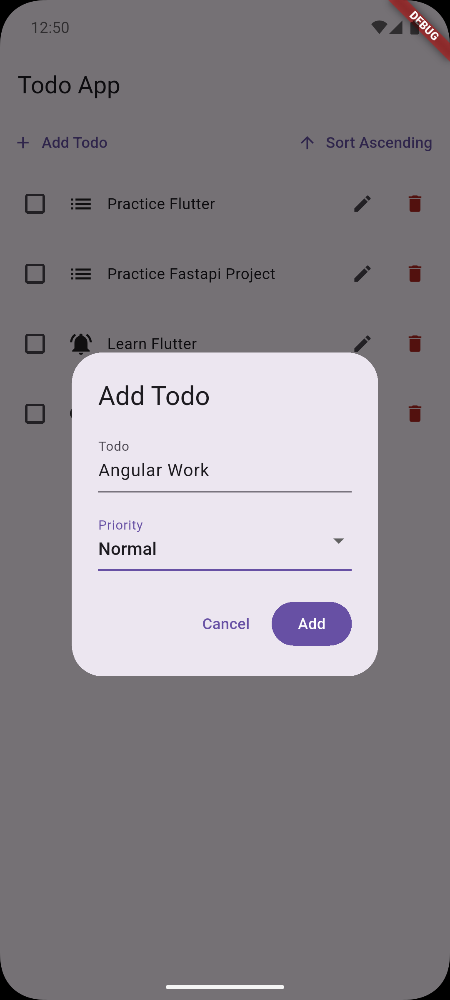
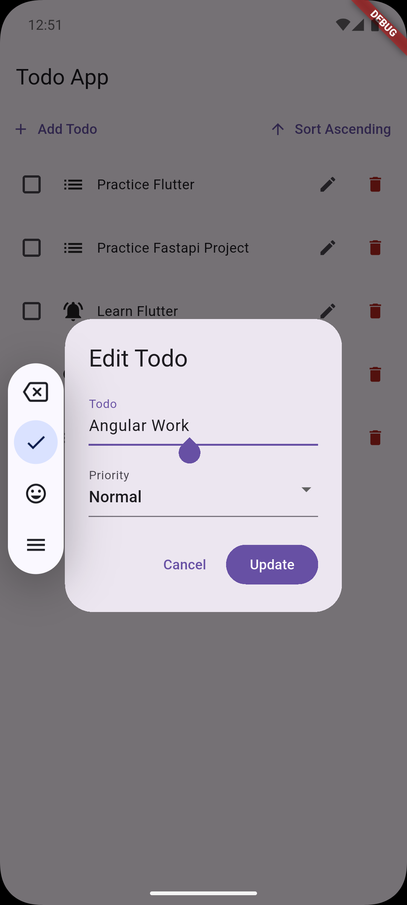
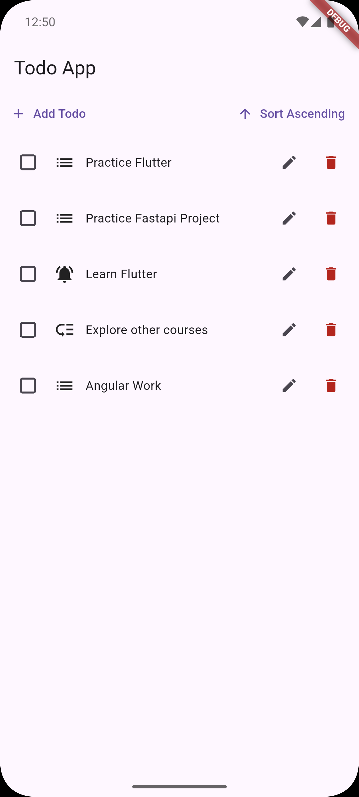

# Todo App - Flutter Internals Demo

A Flutter application demonstrating Flutter internals, focusing on Keys and UI update mechanisms.

    

## Features

- **Checkable Todo Items**: Toggle completion state with checkboxes
- **Priority Levels**: Urgent, Normal, and Low with distinct icons
- **Sorting**: Toggle ascending/descending alphabetical order
- **Keys Demo**: Demonstrates proper use of ObjectKey for widget identity

## Concepts Covered

- **Flutter Keys**: Using `ObjectKey` to maintain widget state during reordering
- **Widget Lifecycle**: Understanding when widgets rebuild vs reuse state
- **StatefulWidget**: Managing local state in checkable items
- **UI Updates**: How Flutter handles widget tree updates efficiently

## Project Structure

```
lib/
├── main.dart                       # App entry point
├── demo_buttons.dart               # UI updates demo buttons
├── ui_updates_demo.dart            # Flutter internals explanation
└── keys/
    ├── keys.dart                   # Todo list with sorting
    ├── todo_item.dart              # Basic todo item widget
    └── checkable_todo_item.dart    # Stateful checkable item
```

## Key Learnings

- Without keys, Flutter may incorrectly reuse widget state when items reorder
- `ObjectKey` preserves state by associating it with the data object
- Understanding the Element tree vs Widget tree relationship

## Getting Started

```bash
flutter pub get
flutter run
```
